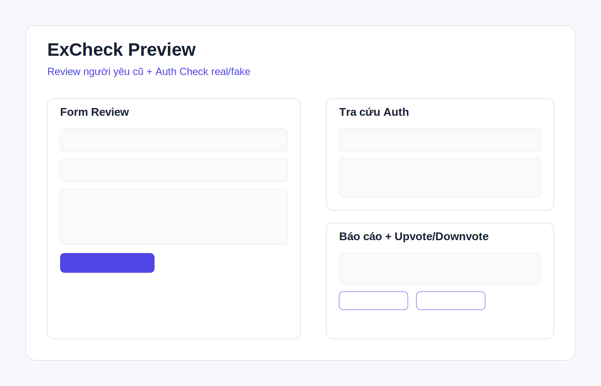

# review-nyc

Ứng dụng web **ExCheck** để cộng đồng chia sẻ review người yêu cũ và check auth FB/Instagram (real/fake).



## Stack hiện tại

- Frontend: HTML/CSS/JS thuần
- Database online: **Supabase (PostgreSQL)**
- Fallback: nếu chưa cấu hình Supabase thì chạy dữ liệu demo local

## Tính năng

- Thêm review mối quan hệ có bằng chứng.
- Bắt buộc bằng chứng bổ sung nếu review tiêu cực.
- Tìm kiếm/lọc review theo tên, khu vực, sentiment.
- Gửi auth-report cho link FB/Instagram (real/fake/chưa rõ).
- Tra cứu theo link profile + upvote/downvote từng báo cáo.


## Quy tắc chống trùng auth-report

Để hạn chế spam, hệ thống chặn submit trùng theo từng ngày:

- Chuẩn hoá `profile_url` thành `normalized_profile_url`.
- Tạo `reason_hash = md5(reason)` để so khớp nội dung lý do.
- Không cho tạo thêm report nếu **cùng `normalized_profile_url` + `verdict` + `reason_hash` trong cùng ngày**.

Khi bị trùng, frontend sẽ hiện thông báo thân thiện: **"Báo cáo tương tự đã tồn tại"**.

## Cấu hình Supabase

### 1) Tạo bảng

Chạy SQL trong file `supabase/schema.sql` trên Supabase SQL Editor.

### 2) Cấu hình URL + ANON KEY

Mở file `config.js` và điền:

```js
window.EXCHECK_SUPABASE_URL = "https://<project-ref>.supabase.co";
window.EXCHECK_SUPABASE_ANON_KEY = "<your-anon-key>";
```

> Không commit service_role key vào frontend.

### 3) Chạy local

```bash
python3 -m http.server 4173
```

Mở `http://localhost:4173`.
